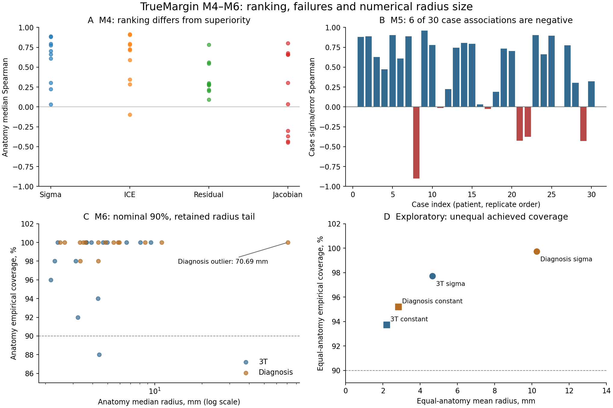

# Registration spread, local error and conservative bounds

**TrueMargin technical report — October 3, 2026**  
This is a reproducible empirical case study, not a peer-reviewed paper or clinical validation.

## Question and design

Does local variability across registration settings contain information about true local registration error, and does that variability become a useful numerical error radius after calibration?

The study keeps these questions separate. The fixed estimator is a nine-member classical B-spline registration ensemble: Mattes mutual-information bins 32/50/64 crossed with gradient tolerances 1e-4/1e-5/1e-6, mesh 3 and at most 15 iterations. Synthetic known deformations supply a displacement reference. Local sigma describes ensemble spread; known error compares the ensemble-mean displacement with that reference. Sampling, deformation, failure handling and estimator settings were frozen before the respective result-bearing studies.

M4 evaluates 10 held-out anatomies with three deformation replicates each and 50 ROI locations per case. Its direct comparison includes inverse-consistency error (ICE), same-modality residual and Jacobian deviation. M5 characterizes the retained M4 outputs rather than generating an independent replication. M6 uses a different, identity-audited challenge substrate: 30 calibration and 30 evaluation anatomies, split equally within two acquisition sources, with one deformation and 50 ROI locations per anatomy. Source-specific hierarchical calibration maps sigma to a radius using error/sigma scores and an explicit finite-sample infinity atom. Spatial points are not treated as independent anatomy trials.

## Results



**Figure 1.** A: each point is one anatomy's median case association, reconstructed from retained outputs; these descriptive points are not confidence intervals. B: all 30 case associations, including six negatives. C: nominal-90% sigma coverage and median radius for all 30 evaluation anatomies, with a logarithmic radius axis. D: a post-outcome exploratory comparison at nominal 90%; achieved coverage differs, so this is not a coverage-matched efficiency comparison. The dashed lines mark nominal 90%. Radius mean in D differs from anatomy median in C. No outlier is removed.

### Local ranking is informative but not uniform

M4's median anatomy-level sigma/error Spearman association is 0.6841, with an anatomy-bootstrap 95% interval [0.3048, 0.8284]. All ten anatomy summaries are positive. ICE's median is 0.7203; the paired sigma-minus-ICE interval [-0.0903, 0.0736] does not establish sigma superiority. Sigma has stronger paired evidence than the residual and Jacobian-deviation baselines within this study.

M5 reveals variation hidden by anatomy summaries: six of 30 case associations are negative, including one at -0.9020. The study-specific high-error/low-sigma rule identifies 39 of 1,500 sampled locations, across seven of ten anatomies. ICE has its own invalid cases and blind spots; the denominators differ and must be retained. These characterizations do not establish a universal failure frequency.

### High coverage comes with conservative radii

All 30 primary M6 evaluations completed. At nominal 90%, equal-anatomy empirical coverage is 97.73% in Prostate-3T and 99.73% in Prostate-Diagnosis. Median anatomy radii are 3.93 and 4.36 mm. A retained Diagnosis anatomy has a 70.69 mm median radius. The 95% thresholds are infinite under the frozen 15-group construction; their 100% empirical coverage provides no finite-radius usefulness evidence.

One calibration ICE failure makes the 3T comparison unavailable. One evaluation ICE failure makes the Diagnosis comparison unavailable. The primary sigma cohort remains complete, but neither source supports the planned full-cohort calibrated comparison. The study does not substitute a reduced cohort.

### Exploratory constant-radius check

After observing M6, a separate analysis fitted a constant radius to calibration errors only, using the same group weights. At nominal 90%, constants of 2.21 and 2.84 mm produce empirical coverage of 93.73% and 95.20%. Sigma's equal-anatomy mean radii are 4.66 and 10.26 mm, approximately 2.11 and 3.62 times larger, with higher coverage. The comparison does not establish dominance because coverage differs and the analysis was not prespecified. It does show why high coverage alone cannot establish an adaptive-efficiency advantage. No accepted threshold or primary result changed.

## Interpretation and limits

One frozen classical ensemble can rank local error on average while reversing that relationship in individual deformations and producing conservative calibrated radii. Rank evidence, numerical coverage and useful precision are distinct findings.

Hyperparameter ensembles, uncertainty/error association and conformal registration are established research areas. This report makes no new-method or theorem claim. Its contribution is a retained, anatomy-aware record of positive and unfavorable evidence for one specified pipeline. Synthetic deformation is not natural disease progression; the work does not establish clinical performance, whole-volume guarantees, arbitrary-voxel coverage, external population generalization or superiority to ICE. Hierarchical coverage interpretation remains conditional on the protocol's exchangeability and sampling assumptions.

The appropriate next engineering step is a bounded inference/replay application. A future research extension needs a distinct question and a prospective test; the challenge's 20 leaderboard/test anatomies remain untouched. A full manuscript decision requires expert assessment of the [contribution review](m4_m6_contribution_review.md).

## Reproduction and provenance

The accepted [M4 result](hyperparameter_known_gt_result.md), [M6 result](m6_phase_b_evaluation_result.md), [claims ledger](../research/CLAIMS.md), frozen protocols and retained numerical records define the evidence boundaries. The exploration is labeled separately in [its record](../results/m6_exploratory/constant_radius_comparison.json). No raw clinical images are included in the result release.

```sh
python scripts/verify_m6_phase_b_result.py results/m6_phase_b
python scripts/m6_exploratory_efficiency.py .
# Figure rendering requires matplotlib; PNG and SVG are retained.
python scripts/plot_m4_m6_evidence.py . docs/figures/m4_m6_evidence
```

The contribution review links the closest primary sources and distinguishes literature claims from our own interpretation. Reproduction of aggregation and numerical summaries is not an independent rerun of registration.
